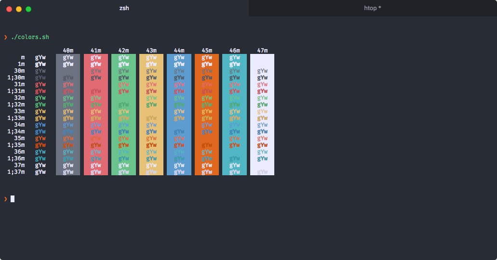

# hyper-firewatch

A theme for [Hyper](https://hyper.is/) inspired by Campo Santo's [Firewatch game](http://www.firewatchgame.com/). Adapted from [Sebastian Szturo](https://github.com/SebastianSzturo)'s [Atom syntax theme](https://atom.io/themes/firewatch-syntax), and forked from [Ben Styles'](https://github.com/leeds-ebooks) [hyperterm-firewatch](https://github.com/leeds-ebooks/hyperterm-firewatch) theme. This fork makes a number of changes to the theme, including:

- Removal window and tab borders for a flatter, cleaner look.
- Addition of further color variations.
- Addition of a background tab activity indicator (*)
- Addition of background colors to inactive tabs

I've only been tested this theme on macOS Sierra, and I cannot attest to the experience on other platforms.

Issues are open and pull requests are most welcome.

## Install

Add `hyper-firewatch` to the plugins list in your `~/.hyper.js` config file.

## License

MIT © [Evan Sims](http://evansims.com), [Ben Styles](http://leeds-ebooks.co.uk)
